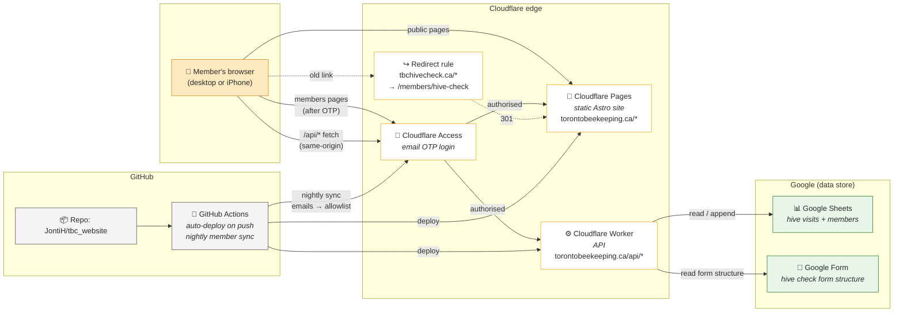

# Toronto Beekeepers Collective — Website

The new website for the Toronto Beekeepers Collective (TBC), replacing the
older WordPress site. Live at **[torontobeekeeping.ca](https://torontobeekeeping.ca)**.

For deep technical details, see [AGENTS.md](AGENTS.md). For first-time setup,
see [SETUP.md](SETUP.md). This README is the high-level overview.

---

## What the site does

| Public pages | Members-only pages (`/members/*`) |
|---|---|
| Home | Members hub |
| About — mission, history, bee yards, FAQ | **Hive Data** — visit calendar, mite chart, sortable table |
| Membership — how to join | **Hive Check Form** — submit a new hive visit |
| | Members List |

The public site is for anyone curious about TBC. The members area is gated
by Cloudflare Access — members log in with a one-time PIN sent to their
email address. No passwords to manage.

---

## Core design principles

1. **Static where possible, dynamic only where it matters.**
   Every page is pre-built into plain HTML at deploy time. The only dynamic
   bits are the three members pages, which fetch live data from a small
   API after the page loads.

2. **Data lives in Google Sheets, not in the code.**
   Hive visits, the member list, and the hive check form are all managed
   in Google Sheets / Google Forms. Updating data never requires a code
   change or a redeploy — just edit the sheet.

3. **The website never sees Google credentials.**
   Browsers talk to a small Cloudflare Worker, and only the Worker holds
   the Google Service Account key. The site is purely static and has no
   secrets.

4. **Auth is handled at the edge by Cloudflare Access.**
   No login forms, no session management code, no password resets. The
   list of allowed member emails is auto-synced from the members Google
   Sheet every night.

5. **Free to run.**
   Hosting (Cloudflare Pages), the API (Cloudflare Workers), and auth
   (Cloudflare Access for ≤50 users) are all on free tiers. Google Sheets
   storage is free. Domain registration is the only ongoing cost.

---

## Architecture at a glance



---

## How a typical request flows

### Public page (e.g. someone visits the homepage)

```
Browser → Cloudflare Pages → pre-built HTML → done
```

That's it. No server-side rendering, no database, no auth. Sub-100ms
load times.

### Members page (e.g. a member opens Hive Data)

```
1. Browser → torontobeekeeping.ca/members/hive-data
2. Cloudflare Access checks for a valid login cookie.
   First visit: sends a 6-digit code to the member's email.
3. After login, the static page is served from Pages.
4. The page's JavaScript fetches /api/hive-data
5. Same Access cookie is honoured for the API request
6. Worker authenticates to Google with a service account JWT,
   pulls the latest sheet rows, and returns JSON.
7. (Worker caches the response for an hour to keep things fast.)
8. Browser renders the calendar, chart, and table from the JSON.
```

### Submitting a hive check (form POST)

```
1. Page fetches /api/hive-form to render the form questions
   (form structure comes live from the Google Form so adding a
    field in the Form automatically updates the website).
2. Member fills it in, hits Submit.
3. Page POSTs the answers to /api/hive-form-submit.
4. Worker appends a new row to the Google Sheet via the Sheets API.
5. Member sees a success card.
```

---

## Repository layout

```
tbc_website/
├── .github/workflows/        # CI: auto-deploy, nightly member sync
├── src/
│   ├── pages/                # One .astro file per route
│   │   ├── index.astro       # Home
│   │   ├── about.astro
│   │   ├── membership.astro
│   │   └── members/          # Members-only pages
│   ├── components/           # Nav, Footer, MembersNav
│   ├── layouts/Base.astro    # HTML shell shared by all pages
│   └── styles/global.css     # Design system: colours, components
├── worker/                   # The API — runs on Cloudflare's edge
│   ├── index.js              # All four endpoints (~360 lines)
│   └── wrangler.toml         # Deploy config
├── public/                   # Static assets (favicon, logo, OG image)
├── AGENTS.md                 # Deep technical reference
├── SETUP.md                  # One-time setup instructions
└── README.md                 # This file
```

---

## Tech stack — short version

- **[Astro](https://astro.build)** for the static site generator — produces
  fast, lightweight HTML with optional in-page JavaScript.
- **Plain CSS** custom design system (no Tailwind, no framework) —
  honeycomb / amber aesthetic matching the TBC logo.
- **[Chart.js](https://www.chartjs.org/)** loaded from a CDN for the mite
  count scatter plot (lazy-loaded, no bundle bloat).
- **Cloudflare Pages** for hosting the static site (free tier).
- **Cloudflare Workers** for the API (free tier — 100k requests/day).
- **Cloudflare Access** for member auth (free for up to 50 users).
- **Google Sheets API + Forms API** for data.
- **GitHub Actions** for CI/CD — every push to `main` auto-deploys.

No databases, no servers, no Docker in production, no Node.js runtime
serving the site at request time. Just static files at the edge plus a
tiny Worker.

---

## Running locally

```bash
# Requires Node.js 22+
npm install
npm run dev          # http://localhost:4321
```

That gets you the static site locally. Calls to `/api/*` will fall back
to the deployed Worker if you set `HIVE_WORKER_URL` in a `.env` file
(see `.env.example`). To run the Worker locally too, use the Docker
Compose setup described in AGENTS.md.

---

## Editing content

| What | Where | Who |
|---|---|---|
| Page copy (Home, About, etc.) | `src/pages/*.astro` files | Code change, push to main |
| Design / colours | `src/styles/global.css` | Code change, push to main |
| Member list | Members Google Sheet | No code change — auto-synced nightly |
| Hive visit data | Hive Notes Google Sheet (or submit via the form) | No code change — live within 1 hour |
| Hive check form questions | The linked Google Form | No code change — live within 1 hour |

---

## Who maintains this

The repo lives at **[github.com/JontiH/tbc_website](https://github.com/JontiH/tbc_website)**.
For questions about how things work, start with [AGENTS.md](AGENTS.md) —
it has architecture decisions, gotchas, and operational details for
future maintainers (human or AI).
