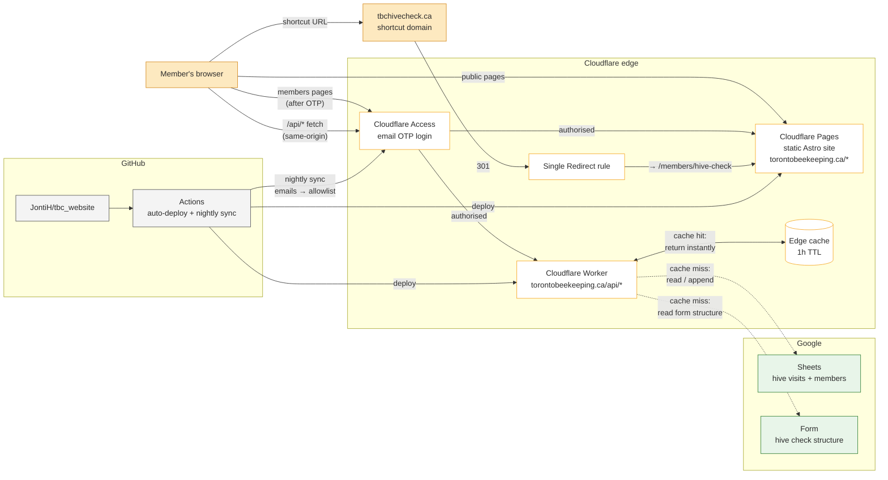

# Toronto Beekeepers Collective Website

The website for the Toronto Beekeepers Collective (TBC), a non-profit
urban beekeeping club in Toronto. Live at
**[torontobeekeeping.ca](https://torontobeekeeping.ca)**.

See [AGENTS.md](AGENTS.md) for deep technical detail and
[SETUP.md](SETUP.md) for first-time setup. This README is the high-level
overview.

## What it does

Public pages cover what TBC is, its history, the bee yards, and how to
join. A members-only section behind email login provides:

- A hive-data dashboard (visit calendar, mite-count chart, sortable
  table)
- A hive-check submission form
- The current member list

## Design choices

The site is fully static. Pages are pre-built HTML; nothing renders at
request time. The only dynamic content is in the members area, which
fetches live data from a small Cloudflare Worker after the page loads.

Data lives in Google Sheets and Google Forms. Hive visits, the member
list, and the hive-check form structure are all managed there. Updating
data does not require a code change or a redeploy. Edit the sheet, wait
up to an hour for the cache to roll over.

The site itself holds no Google credentials. Browsers talk to the
Worker, and only the Worker holds the service-account key.

Auth runs at the edge through Cloudflare Access. There are no login
forms or session-management code in the site. The allowed email list is
synced from the members Sheet to Cloudflare every night.

Everything sits on Cloudflare and Google free tiers. The only ongoing
cost is the domain registration.

## How it fits together



## Request flow

**Public page.** Browser hits Cloudflare Pages, gets pre-built HTML, done.

**Members page.** Browser hits the page; Access checks for a login
cookie; first-time visitors get a six-digit code by email. After login,
Pages serves the HTML, the page's JS calls `/api/hive-data` (or
similar), the same Access cookie authorises the API request, and the
Worker returns JSON.

**Hive check submission.** Members never touch the real Google Form.
The page calls `/api/hive-form` to read the Form's question list via
the Google Forms API, then builds a TBC-styled form in JS. On submit,
the page POSTs the answers to `/api/hive-form-submit`, and the Worker
appends a row directly to the underlying Sheet via the Sheets API. The
Form is only a schema definition; the website is the actual UI and the
submission path.

## Caching

The Worker stores responses in Cloudflare's **edge cache** with a
1-hour TTL. This cache lives on Cloudflare's servers, not in the
browser, and is **shared across all members hitting the same Cloudflare
data centre** (in practice, that's the Toronto edge for everyone). One
member's request populates the cache for everyone else.

The browser caches nothing. The Worker sends `Cache-Control: no-store`
on every response, so every page load hits the edge fresh.

A form submission writes to the Sheet immediately, but `/api/hive-data`
keeps serving the cached pre-submission JSON until its TTL rolls over.
The new row shows up on Hive Data anywhere between a few seconds and
~1 hour later, depending on where the cache entry was in its TTL when
the submission landed. Bumping `CACHE_VER` in `worker/wrangler.toml`
and re-deploying force-busts all edge caches.

## Repository layout

```
tbc_website/
├── .github/workflows/        CI: auto-deploy, nightly member sync
├── src/
│   ├── pages/                One .astro file per route
│   │   ├── index.astro       Home
│   │   ├── about.astro
│   │   ├── membership.astro
│   │   └── members/          Members-only pages
│   ├── components/           Nav, Footer, MembersNav
│   ├── layouts/Base.astro    HTML shell shared by all pages
│   └── styles/global.css     Design system: colours, components
├── worker/                   The API: runs on Cloudflare's edge
│   ├── index.js              All four endpoints (~360 lines)
│   └── wrangler.toml         Deploy config
├── public/                   Static assets (favicon, logo, OG image)
├── AGENTS.md                 Deep technical reference
├── SETUP.md                  One-time setup instructions
└── README.md                 This file
```

## Tech

[Astro](https://astro.build) static site generator. Plain CSS, no
framework, no Tailwind. [Chart.js](https://www.chartjs.org/) loaded
from a CDN for the mite-count chart (lazy-loaded). Cloudflare Pages
for the site, Cloudflare Workers for the API, Cloudflare Access for
auth. Google Sheets API and Forms API for data. GitHub Actions for
CI/CD.

No databases, no servers, no Docker in production, no Node.js runtime
serving the site at request time.

## Running locally

Docker Compose, pick a profile based on what you need:

```bash
docker compose --profile mock up   # Astro + in-memory mock API (recommended)
docker compose --profile live up   # Astro pointed at the production API
docker compose --profile full up   # Astro + real Worker (needs Google creds)
```

The `mock` profile is the everyday choice. It runs the Astro dev server
on `http://localhost:4321` plus a small mock server at `:8788` that
serves fake hive data, members, and form structure from `mocks/*.json`.
Submissions are appended in memory and appear on Hive Data immediately.
No Google credentials, no Cloudflare Access, fully offline.

The mock's "Submitting as <email>" banner on the hive-check form
auto-detects your email from `git config user.email`. Override with
`MOCK_IDENTITY_EMAIL=you@example.com docker compose --profile mock up`.

Without Docker, if you have Node 22+:

```bash
npm install
npm run dev          # http://localhost:4321
```

Full details in [AGENTS.md](AGENTS.md#local-development).

## Editing content

| What | Where | How |
|---|---|---|
| Page copy (Home, About) | `src/pages/*.astro` | Code change, push to main |
| Design / colours | `src/styles/global.css` | Code change, push to main |
| Member list | Members Google Sheet | No code change, synced nightly |
| Hive visit data | Hive Notes Google Sheet (or submit via the form) | No code change, live within 1 hour |
| Hive check form questions | Linked Google Form | No code change, live within 1 hour |

## Who maintains it

The repo lives at
**[github.com/JontiH/tbc_website](https://github.com/JontiH/tbc_website)**.
For questions, [AGENTS.md](AGENTS.md) has architecture decisions,
gotchas, and operational details.
